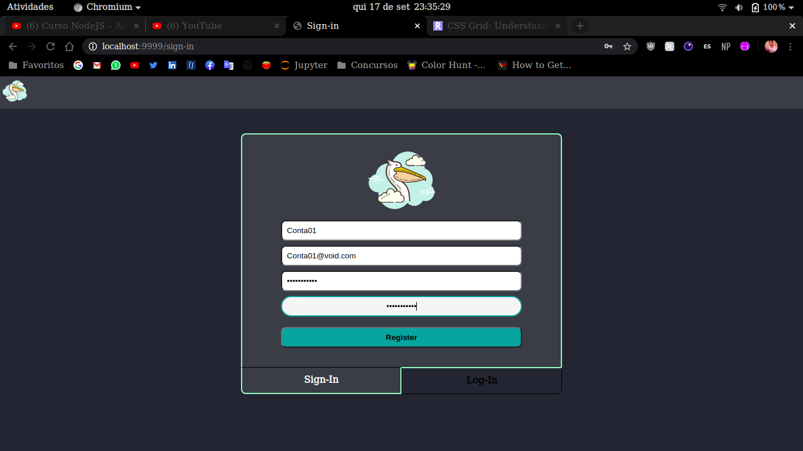
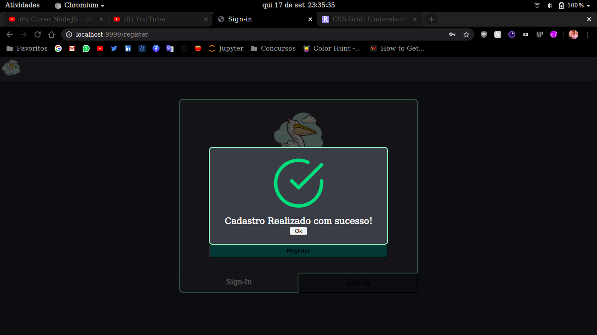
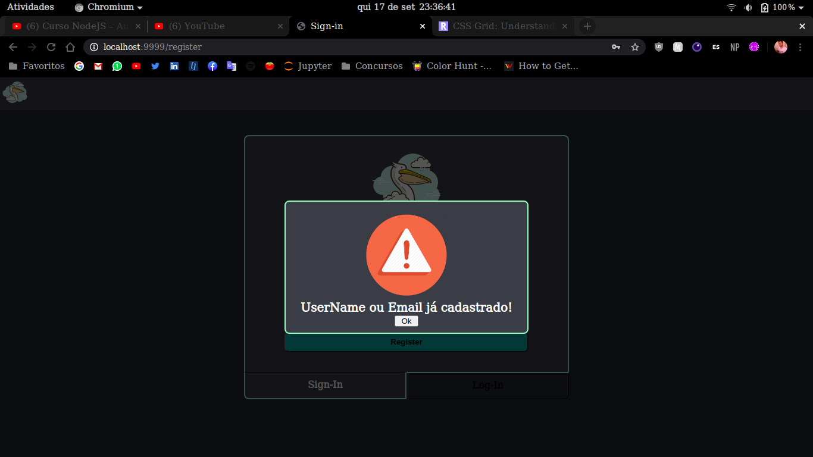
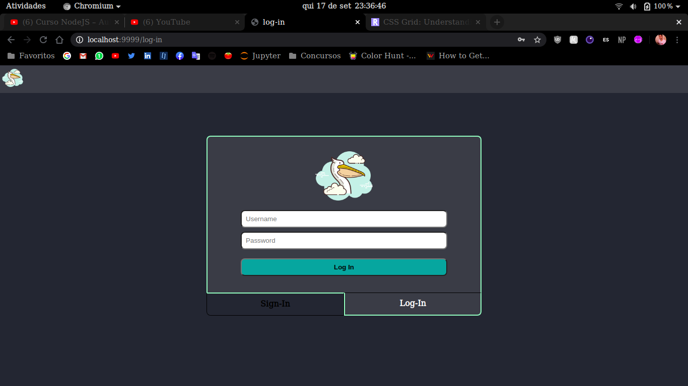
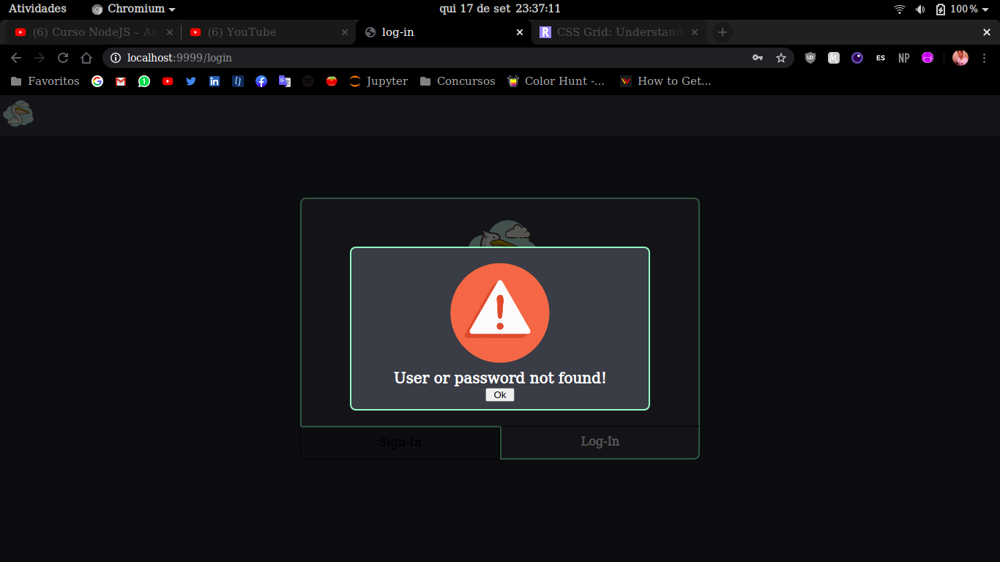

# Trabalho de NodeJs

## Objetivo

Fazer rotas em NodeJs e utilizar  MongoDB para armazenar e visualizar dados.

## Rotas

* GET 		"/" ou "/sign-in" 	: rota de cadastro de usuário  
* GET		"/log-in" 		: rota de login de usuário
* POST		"/register"		: rota de cadastro de usuário no banco
* POST		"/login"			: rota de verificão de usuário valido
* GET		"/api/users"		: json com os usuários cadastrados

